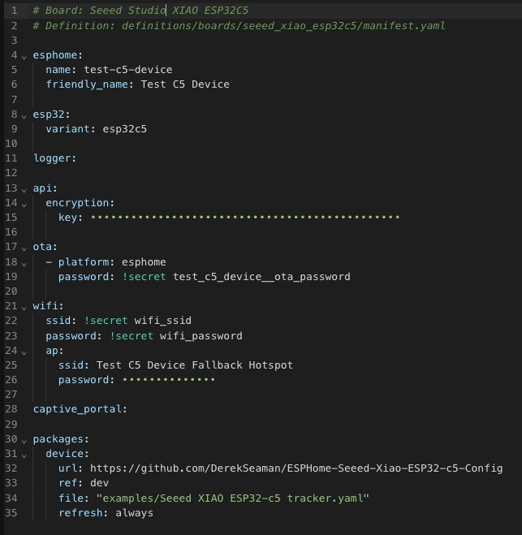
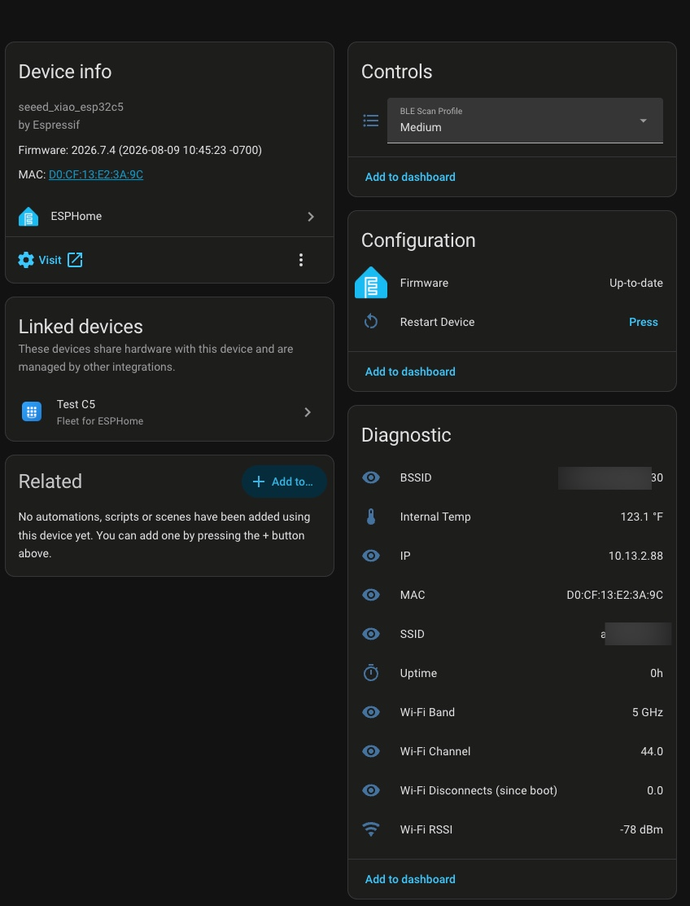

# Seeed Studio XIAO ESP32‑C5 ESPHome Device Builder Package

This repository contains a reusable **ESPHome Device Builder package** for the Seeed Studio XIAO ESP32‑C5 (esp32c5) boards. Several configurations are provided for you to choose from. Each configuration is covered below. These are designed to work with ESPHome Device Builder 2026.7 and later.

Quick overview

- Layout:

  - `examples/Seeed XIAO ESP32-c5 base.yaml` — C5 base configuration (board, wifi, sensors, etc.), no Bluetooth proxy

  - `examples/Seeed XIAO ESP32-c5 IRK.yaml` — C5 board specifics designed to be used with my IRK Capture package (see below)
 
  - `examples/Seeed XIAO ESP32-c5 proxy.yaml` — C5 base configuration with customizable Bluetooth proxy functionality
 
  - `examples/Seeed XIAO ESP32-c5 remote.yaml` — Package definition designed to be used with a generic ESPHome Device Builder C5 device configuration. This will reference one of the above configurations and dynamically pull it in at compile time.

**Key feature:** The ESP32-C5 supports dual-band **2.4 GHz and 5 GHz Wi-Fi 6 (802.11ax)**, making it the first XIAO ESP32 variant with 5 GHz capability. Antenna switching on the C5 is hardware-managed (LFD182G45DCHD277 RF switch) and requires no GPIO control — unlike the C6 which uses a software-controlled switch. I strongly recommend purchasing the Seeed Studio 2.4 GHz antenna, as Wi-Fi reception without it is very poor.

## Using with ESPHome Device Builder

This is an **ESPHome Device Builder package** designed to work seamlessly with the ESPHome Device Builder tool in Home Assistant. This has been tested with ESPHome Device Builder 2026.7.4. Follow these steps to create a new device with the custom Seeed Studio XIAO ESP32-C5 configuration:

1. Install the **ESPHome Device Builder** add-on from the Home Assistant Add-on Store
2. Go into the **ESPHome Device Builder** and in the upper right click on **+ Create device**
3. Select **Create new project**
4. Click on **ESP32-C5**, then type **Seeed** in the search boards field
5. Click **+ Select** on the **Seeed Studio XIAO ESP32C5** card
6. Enter a device name, click **Finish Setup**
7. Paste the contents of the C5 remote file to the bottom of your ESPHome Device Builder template [C5 Remote File](https://github.com/DerekSeaman/ESPHome-Seeed-Xiao-ESP32-c5-Config/blob/main/examples/Seeed%20XIAO%20ESP32-c5%20remote.yaml)
8. Depending on which version you want, modify **file:** as needed (proxy, base, IRK)
9. Modify any other settings as needed, then install to your Seeed Studio XIAO ESP32-C5 device.

Your configuration should look something like this, except for ‘ref’ pointing to **main**. 

## IRK Configuration Details

I built a special C5 IRK configuration that is designed to be used with my IRK Capture package for ESPHome. It can be found at: [DerekSeaman/irk-capture](https://github.com/DerekSeaman/irk-capture). This eliminates some of the duplicate settings already built into my IRK Capture package and only adds the unique settings needed for the Seeed Studio XIAO ESP32-C5.

## Wi-Fi Considerations

The base configuration has the Wi-Fi band set to AUTO. This means it will use both the 2.4 GHz and 5 GHz bands. If you have a dedicated 5 GHz SSID, I suggest creating new 5 GHz secrets in ESPHome Device Builder. I personally use “wifi5_ssid” and “wifi5_password”. Then modify your device configuration to use the 5 GHz secrets. I’ve also enabled the 802.11v and 802.11k features to help with roaming.

## Bluetooth Proxy

If you use the **proxy** configuration, your C5 will act as a Bluetooth proxy. I created three scan profiles: low, medium, and high. Depending on your needs, you can set the scan profile as needed. If you are using the proxy with room-level presence detection, medium or high is recommended. Otherwise, low should be sufficient and will use less Wi-Fi bandwidth.

## Status LED Patterns

The onboard LED (GPIO27, yellow USER LED) provides visual feedback about the device state:

| Pattern | Meaning |
|---------|---------|
| Solid ON | Everything OK - WiFi connected, API connected with active client |
| Slow blink (~1Hz) | Warning - WiFi connected but API client not connected/subscribed |
| Fast blink (~2-3Hz) | Error - No WiFi connection |
| Very fast blink (~10Hz) | Critical error during boot or OTA in progress |

## ESPHome Device Page

Here's what the proxy device looks like in Home Assistant's ESPHome integration:

The device page shows:

- **Device info**: Board type, firmware version, and MAC address
- **Controls**: BLE Scan Profile selector (Low/Medium/High)
- **Configuration**: Firmware management and OTA updates
- **Diagnostic**: BSSID, internal temperature, IP address, MAC address, SSID, uptime, Wi-Fi Band, Wi-Fi Channel, Wi-Fi disconnects (since boot), and Wi-Fi RSSI

