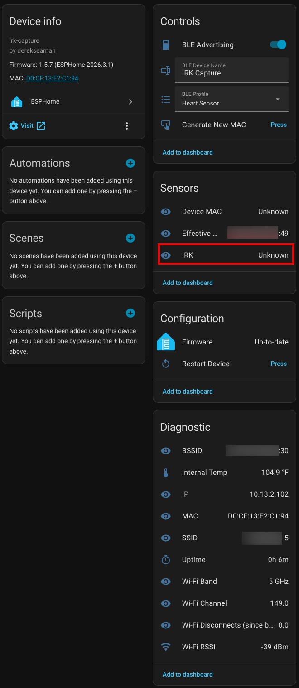

# Seeed XIAO ESP32‑C5 ESPHome Device Builder Package

This repository contains a reusable **ESPHome Device Builder package** for the Seeed XIAO ESP32‑C5 (esp32c5) boards. The project provides a shared base configuration package that can be included in device YAMLs to keep device files concise and consistent. The configuration is tailored for Home Assistant Bluetooth proxy and scanning functionality. I use it with the "Bermuda BLE Trilateration" HACS add-on for room-level presence detection.

Quick overview

- Purpose: Reusable base configurations for Seeed XIAO ESP32‑C5 boards

- Layout:

  - `examples/Seeed XIAO ESP32-c5 base.yaml` — C5 base configuration (board, wifi, sensors, etc.)

  - `examples/Seeed XIAO ESP32-c5 IRK.yaml` — C5 board specifics designed to be used with my IRK Capture package
 
  - `examples/Seeed XIAO ESP32-c5 tracker.yaml` — C5 base configuration with Bluetooth tracking and proxy sensors
 
  - `examples/Seeed XIAO ESP32-c5 remote.yaml` — Package definition designed to be used with a generic ESPHome Builder C5 configuration

**Key feature:** The ESP32-C5 supports dual-band **2.4 GHz and 5 GHz Wi-Fi 6 (802.11ax)**, making it the first XIAO ESP32 variant with 5 GHz capability. Antenna switching on the C5 is hardware-managed (LFD182G45DCHD277 RF switch) and requires no GPIO control — unlike the C6 which uses a software-controlled FM8625H switch.

## Using with ESPHome Device Builder

This is an **ESPHome Device Builder package** designed to work seamlessly with the ESPHome Builder tool in Home Assistant:

1. Install the ESPHome Device Builder add-on from the Home Assistant Add-on Store
2. Go into the ESPHome Builder and in the upper right click on **+ Create device**
3. Select **Create new project**
4. Click on **ESP32-C5**, then type **Seeed** in the search boards field
5. Click **+ Select** on the **Seeed Studio XIAO ESP32C5** card
6. Enter a device name, click **Finish Setup**
7. Paste the contents of the C5 remote file to the bottom of your ESPHome Builder template [C5 Remote File](https://github.com/DerekSeaman/ESPHome-Seeed-Xiao-ESP32-c5-Config/blob/main/examples/Seeed%20XIAO%20ESP32-c5%20remote.yaml)
8. Depending on which version you want, modify file: as needed (tracker, base, IRK)

## Status LED Patterns

The onboard LED (GPIO27, yellow USER LED) provides visual feedback about the device state:

| Pattern | Meaning |
|---------|---------|
| Solid ON | Everything OK - WiFi connected, API connected with active client |
| Slow blink (~1Hz) | Warning - WiFi connected but API client not connected/subscribed |
| Fast blink (~2-3Hz) | Error - No WiFi connection |
| Very fast blink (~10Hz) | Critical error during boot or OTA in progress |

## ESPHome Device Page

Here's what the device looks like in Home Assistant's ESPHome integration:

The device page shows:

- **Device info**: Board type, firmware version, and MAC address
- **Controls**: BLE Scan Profile selector (Low/Medium/High)
- **Configuration**: Firmware management and OTA updates
- **Diagnostic**: BSSID, internal temperature, IP address, MAC address, SSID, uptime, Wi-Fi Band, Wi-Fi Channel, Wi-Fi disconnects (since boot), and Wi-Fi RSSI

## IRK Capture Device Page

Here's what the IRK capture variant looks like in Home Assistant:

The IRK capture device page shows:

- **Device info**: Board type, firmware version, and MAC address
- **Controls**: BLE Advertising toggle, BLE Device Name input, BLE Profile selector, and Generate New MAC button
- **Sensors**: Device MAC (paired device address), Effective MAC (current BLE advertising address), and IRK (captured Identity Resolving Key)
- **Configuration**: Firmware management and OTA updates
- **Diagnostic**: BSSID, internal temperature, IP address, MAC address, SSID, uptime, Wi-Fi Band, Wi-Fi Channel, Wi-Fi disconnects (since boot), and Wi-Fi RSSI
